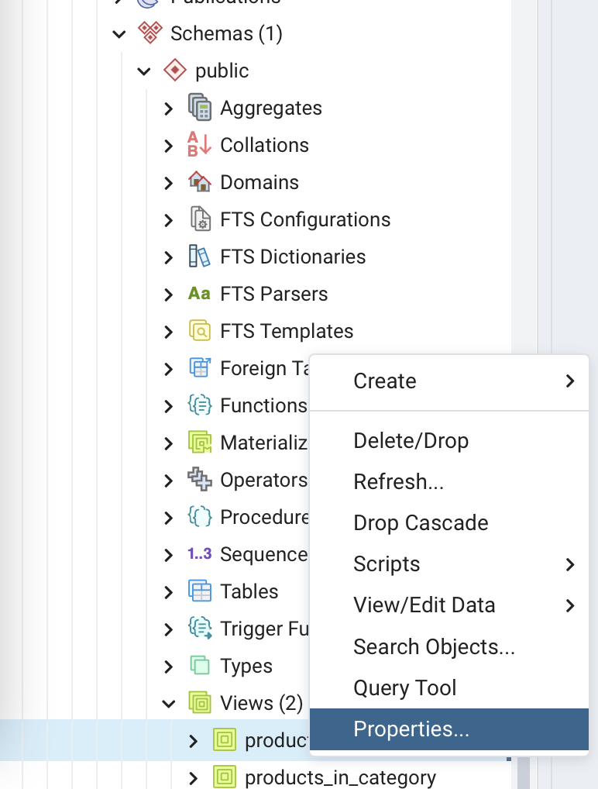
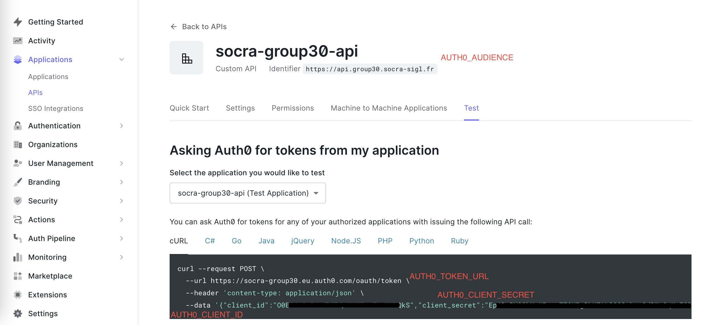
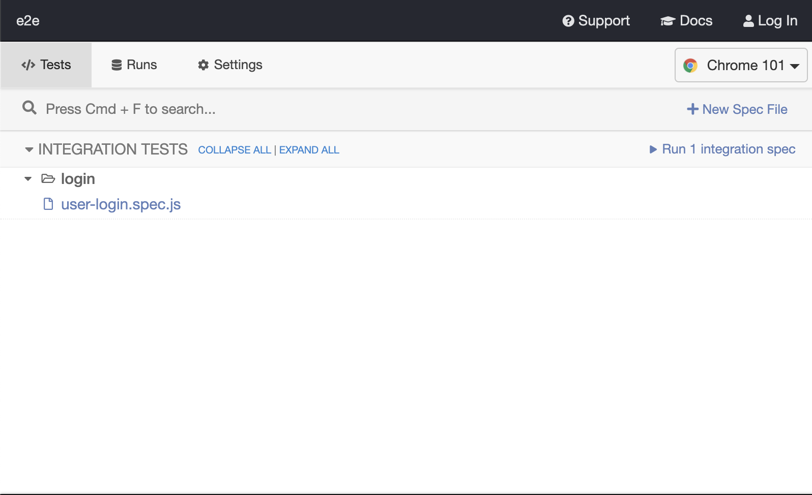
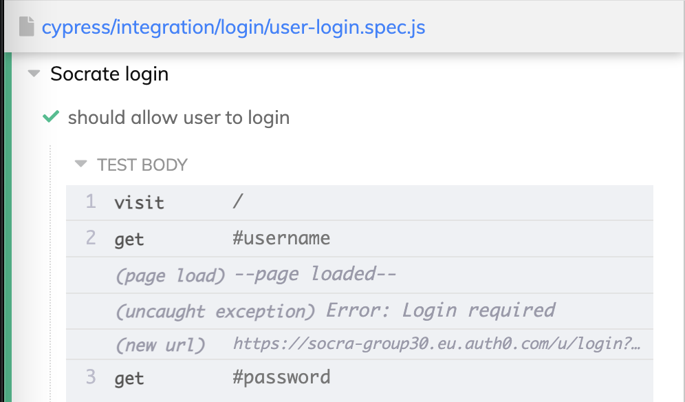

# QA workshop

This workshop is made for EPITA SIGL 2023 students of ARLA course.

You will learn how to:

- implement unit test in Node using [Jest](https://jestjs.io)
- implement basic fonctional in Node test using [Cucumber](https://cucumber.io)
- implement e2e test in Node using [Cypress.io](https://cypress.io)
- create a pre-production (or CI for Continuous Integration) environment
- integrate tests to your CD pipeline

## Step 0: Create the carbon tax logic

**Objective**: Discounts and products in categories displays a carbonTax
based on the distance between the product's producer and the user's current position.

### Adapt postgreSQL views to include gps position

- From pgAdmin4, update both `local` and `production` databases's views:
  - Go to local > Databases > socra > Schemas > public > views > Right click on `product_on_discount` > Properties
    
  - In the `Code` tab, replace the view code with:
  ```sql
   SELECT product.id,
    product.name,
    product.price,
    product.url_image AS image,
    producer.description,
    round((product.price::double precision - product_discount.discount)::numeric, 2) AS discount,
    product_discount.valid_until,
    address.gps_point AS gpspoint
   FROM product
     JOIN product_discount ON product_discount.product_id = product.id
     JOIN producer ON producer.external_id = product.producer_external_id
     JOIN producer_address ON producer.id = producer_address.producer_id
     JOIN address ON address.id = producer_address.address_id;
  ```
  - Save and confirm warning message
  - Do the same for `products_in_category`:
  ```sql
   SELECT product.id,
    product.name,
    product.url_image AS image,
    producer.description,
    product.price,
    category.id AS categoryid,
    category.name AS categoryname,
    address.gps_point AS gpspoint
   FROM product
     JOIN product_category ON product.id = product_category.product_id
     JOIN category ON category.id = product_category.category_id
     JOIN producer ON producer.external_id = product.producer_external_id
     JOIN producer_address ON producer.id = producer_address.producer_id
     JOIN address ON address.id = producer_address.address_id;
  ```
  - Do the same for `production` database of your group (socra-group-XX)

### Adapt backend

Create a new `backend/src/distance.js` with:

```js
/**
 *
 *  Haversine: Compute the shortest distance over the earth’s surface between two positions
 *
 *  formula:	a = sin²(Δφ/2) + cos φ1 ⋅ cos φ2 ⋅ sin²(Δλ/2)
 *              c = 2 ⋅ atan2( √a, √(1−a) )
 *              d = R ⋅ c
 *  where:
 *              φ is latitude, λ is longitude, R is earth’s radius (mean radius = 6,371km);
 *
 * See. https://www.movable-type.co.uk/scripts/latlong.html
 *
 * @returns distance in meters
 */
function haversine(
  sourceLatitude,
  sourceLongitude,
  destLatitude,
  destLongitude
) {
  const R = 6371e3; // Earth radius in meters

  // convert to radians
  const φ1 = (sourceLatitude * Math.PI) / 180;
  const φ2 = (destLatitude * Math.PI) / 180;
  const Δφ = ((destLatitude - sourceLatitude) * Math.PI) / 180;
  const Δλ = ((destLongitude - sourceLongitude) * Math.PI) / 180;

  const a =
    Math.sin(Δφ / 2) * Math.sin(Δφ / 2) +
    Math.cos(φ1) * Math.cos(φ2) * Math.sin(Δλ / 2) * Math.sin(Δλ / 2);
  const c = 2 * Math.atan2(Math.sqrt(a), Math.sqrt(1 - a));
  const d = R * c; // in meters
  return d;
}

/**
 * Computes distance in kilometers from a source position
 * to a destination position.
 *
 * Position is an object like:
 * { latitude: number, longitude: number }
 *
 * @param {*} startPos Position of the source geolocation
 * @param {*} destPos Position of the destination geolocation
 * @returns distance in kilometers between source position and destination position
 */
function distance(startPos, destPos) {
  const distanceInMeters = haversine(
    startPos.latitude,
    startPos.longitude,
    destPos.latitude,
    destPos.longitude
  );
  return Math.round(distanceInMeters / 1000);
}

module.exports = { distance };
```

This module exposes a function to compute distance from two GPS point on the planet.

Let's use this distance module to apply dynamically a carbon tax based on where the user is.

- Create a new `backend/src/tax.js` file with:

```js
const { distance } = require("./distance");

function addCarbonTax(userPosition, products) {
  return products.map(function (product) {
    const {
      gpspoint: { x, y },
    } = product;
    const productPosition = { latitude: x, longitude: y };
    const productDistance = distance(userPosition, productPosition);
    const carbonTax = productDistance / 100;
    // make sure price and discount are numbers;
    // and add carbonTax to product
    return {
      ...product,
      price: +product.price,
      ...(product.discount && { discount: +product.discount }),
      carbonTax,
    };
  });
}

module.exports = { addCarbonTax };
```

This module exposes a function `addCarbonTax` that compute a tax amount based on user and product position.
The `amount of carbonTax (euros) = (distance (km) user <-> producer) / 100`.

Now let's adapt `/v1/discounts` and `/v1/products/:categoryId` route:

- convert to `POST` expecting `{user: {latitude: ..., longitude: ...}}` as incoming payload
- add carbon tax to products to response

In `backend/src/server.js`, apply the following modifications:

```js
// ...
const { addCarbonTax } = require("./tax");
// ...
app.post("/v1/discounts", async (req, res) => {
  try {
    const {
      user: { latitude, longitude },
    } = req.body;
    const discounts = await RDB.getAvailableDiscounts(0, 4);
    const withTax = addCarbonTax({ latitude, longitude }, discounts);
    res.send(withTax);
  } catch (e) {
    res.send({ error: e.message });
  }
});

app.post("/v1/products/:categoryId", async (req, res) => {
  const categoryId = req.params.categoryId;
  try {
    const {
      user: { latitude, longitude },
    } = req.body;
    // make sure it's an integer; and not an SQL injection!
    const safeCategoryId = +categoryId;
    const cateogryProducts = await RDB.getProductInCategory(
      safeCategoryId,
      1,
      10
    );
    const withTax = addCarbonTax({ latitude, longitude }, cateogryProducts);
    res.send(withTax);
  } catch (e) {
    res.send({ error: e.message });
  }
});
// ...
```

- It calls `addCarbonTax` with products queried from postgres
- and returns the list of products with `carbonTax` on each product.

### Adapt frontend

You need to adapt the frontend to POST user's current position when fetching `products` and `discounts`.

- You will use the [`navigator.geolocation`](https://developer.mozilla.org/en-US/docs/Web/API/Geolocation_API) browser API to get user's current position
- Change `callApi` to `postApi` on `Discounts` and `ProductCategory` component

First, let's add the following function to `frontend/src/utils.js`:

```js
// ...
// Small helper to "promisify" the geolocation API from browser
async function getPosition(opt) {
  return new Promise(function (resolve, reject) {
    return navigator.geolocation.getCurrentPosition(resolve, reject, opt);
  });
}

// See. https://developer.mozilla.org/en-US/docs/Web/API/Geolocation_API
export async function getUserPosition() {
  const {
    coords: { latitude, longitude },
  } = await getPosition();
  return { latitude, longitude };
}
```

- `getUserPosition` returns the `latitude` and `longitude` of the user's browsers, depending on where the user is located.

- Adapt `frontend/src/Dicsounts.js` with:

```js
// ...
import { getUserPosition, postApi } from "./utils";
// ...
function Discounts() {
  // ...

  React.useEffect(function () {
    async function fetchDiscounts() {
      try {
        const token = await getAccessTokenSilently();
        const userPosition = await getUserPosition();
        const discountProducts = await postApi(token, "/v1/discounts", {
          user: userPosition,
        });
        setDiscounts(discountProducts);
      } catch {
        console.log("ERROR: can't fetch discounts");
      }
    }
    fetchDiscounts();
  }, []);
  return (/*...*/)
}
// ...
```

It just adds user geo position info when querying discount

```js
const userPosition = await getUserPosition();
const discountProducts = await postApi(token, "/v1/discounts", {
  user: userPosition,
});
```

Do the same for `frontend/src/ProductCategory.js`:

```js
// ...
import { getUserPosition, postApi } from "./utils";

function ProductCategory() {
  // ...

  React.useEffect(() => {
    async function fetchCategoryProducts() {
      const token = await getAccessTokenSilently();
      const userPosition = await getUserPosition();
      const products = await postApi(token, `/v1/products/${categoryId}`, {user: userPosition});
      setCategoryProducts(products);
    }
    fetchCategoryProducts()
  }, [])

  return (/* ... */);
};
// ...
```

You should be all set. Make sure all services are started:

- frontend (`npm start` inside `frontend/`)
- backend (`node src/server.js` inside `backend/`)
- postgres (`docker compose up -d` inside `database/postgres`)
- mongodb (`docker compose up -d` inside `database/mongodb`)

Visit [localhost:8080](http://localhost:8080).
You should have a popup asking permission to use `Location` API.
Accept it and you should have products with carbon tax!

## Step 1: Implement unit test on the carbon tax logic

**Objective**: Write a unit test for the `distance` module in the web API.

### Install unit test framework

To implement unit tests, you will use a new node module called [Jest](https://jestjs.io).

> Note: You often encounter mainly two JavaScript testing frameworks: [Jest](https://jestjs.io) and [Mocha](https://mochajs.org).
> Those two tools serve same purpose, but we found that Jest offers a better development experience. This is important since developpers are often lazy to write tests!

To install [Jest](https://jestjs.io), install it like any other node modules (from `backend/`):

```sh
# From your backend/ folder:
# make sure you have correct node version activated
nvm use v16
# install the jest module
npm i --save-dev jest
# It should create a jest.config.js
```

Now, let's add a new script inside your `backend/package.json` file to run test using jest when typing `npm test`:

```json5
// inside backend/package.json
// ...
  "scripts": {
    "test": "jest --passWithNoTests"
  }
```

Now try to run test typing `npm test` or `npm t`. You should see the following output:

```plain
> ...
> jest --passWithNoTests

No tests found, exiting with code 0
```

If you see this logs, it means you've correctly set Jest.

### Create unit test for `distance`

Let's first create a simple unit test to check the expected behaviour of the `extractPageOption` fuction.

Create a new file `backend/src/distance.spec.js` with:

```js
const { distance } = require("./distance");

describe("distance", function () {
  test("should correctly compute distance between two GPS coordinates", () => {
    const validQuery = { page: "1", limit: "10" };
    const { page, limit } = extractPageOptions(validQuery);
    expect(page).toEqual(1);
    expect(limit).toEqual(10);
  });
});
```

Now run this test and make sure it's running without error:

```sh
# from backend/
# Both `npm t` and `npm test` are equivalent
nvm use v16
npm test

# Output:
# > backend@1.0.0 test
# > jest --passWithNoTests
#
#  PASS  src/distance.spec.js
#   ...
#
# Test Suites: 1 passed, 1 total
# Tests:       1 passed, 1 total
# Snapshots:   0 total
# Time:        0.332 s
# Ran all test suites.
```

- Now change the `expectedDistance` value by any other value. Run `npm test` again.
  You can see that the test failed, as expected!

- Put back the `expectedDistance` so that test is green again

### Challenge: create unit tests for add carbon tax

**Objective** Create unit tests for `addCarbonTax` function inside `backend/src/tax.js`

- Create a new file `backend/src/tax.spec.js` with:

```js
const { addCarbonTax } = require("./tax");

describe("addCarbonTax", function () {
  const userPosition = { latitude: 48.85837, longitude: 2.294481 };
  const discounts = [
    {
      id: 678,
      name: "Discounted Product 1",
      price: "26.52",
      image: "https://my.product.image.address.com/1",
      description: "Discounted product 1",
      discount: "18.56",
      valid_until: "2022-06-20T22:00:00.000Z",
      gpspoint: { x: 42.614202305, y: 2.9236236030000002 },
    },
  ];

  const products = [
    {
      id: 576,
      name: "Product 1",
      image: "https://my.product.image.address.com/1",
      description: "Product 1",
      price: "24.31",
      categoryid: 1,
      categoryname: "Category 1",
      gpspoint: { x: 43.33011498, y: 2.6632184260000002 },
    },
  ];

  test("should correctly compute carbonTax for product in category", function () {
    // TODO: Make sure addCarbonTax(userPosition, products) returns a list of 1 product where
    // the expected carbonTax = 6.15
  });

  test("should correctly compute carbon tax for product on discount", function () {
    // TODO: make sure addCarbonTax(userPosition, discounts) returns a list of 1 product where
    // the expected product.carbonTax = 6.96
  });

  test("should correctly convert price and discount to number", function () {
    // TODO: make sure addCarbonTax(userPosition, discounts) returns a list of 1 product where
    // product.price and product.discount are `number` (price = 26.52 and discount = 18.56)
  });

  test("should not include discount when product doens't have discount", function () {
    // TODO: make sure addCarbonTax(userPosition, products) returns a list of 1 product where
    // product.discount is undefined.
    // See. https://jestjs.io/fr/docs/expect#tobeundefined
  });
});
```

- Replace all `TODO` comment by the actual test implementation.

## Step 2: Implement functional test

**Objective**: Implement a functional test on your web API.
The idea is to test the web API from outside.
Meaning we want to query `v1/products/:categoryId` from outside and make assertions on the response

### Install supertest and axios

- Install [`supertest`](https://github.com/visionmedia/supertest) and [`axios`](https://github.com/axios/axios) in your `backend/` folder

```sh
# From backend/
nvm use v16
npm install supertest --save-dev
npm install axios --save
```

- axios comes handy when you will need to fetch a valid auth token from auth0 to run API tests (since Web APIs are behind auth)

### Setup supertest

- Your web API is secured behind an auth layer. To query your socrate API, you need a valide `Bearer token`.
- From your Auth0 dashboard: 
  - go to Application > APIs > socra-groupXX-api
  - go to the `Test` tab and select `cURL` sub tab in the example

- Add to the existing a new `backend/.env` file the following credentials:
  ```conf
  AUTH0_CLIENT_ID=<your auth client ID>
  AUTH0_CLIENT_SECRET=<your auth client secret>
  AUTH0_AUDIENCE=<your API audience>
  AUTH0_TOKEN_URL=<your group API url>
  ```

- Export the `app` instance from `backend/src/server.js` (add `module.exports` at the end of the file):

```js
// ...
module.exports = { app };
```

- And create new API tests inside `backend/src/server.spec.js` with:
```js
const request = require("supertest");
const axios = require("axios");
const { app } = require("./server");

const apiCredentials = {
  client_id: process.env.AUTH0_CLIENT_ID,
  client_secret: process.env.AUTH0_CLIENT_SECRET,
  audience: process.env.AUTH0_AUDIENCE,
  grant_type: "client_credentials",
};

async function getAuthToken() {
  const body = JSON.stringify(apiCredentials);
  const {
    data: { access_token },
  } = await axios.post(process.env.AUTH0_TOKEN_URL, body, {
    headers: { "Content-Type": "application/json" },
  });
  return access_token;
}

describe("Socrate API", () => {
  let token;

  function getHeaders() {
    return {
      Accept: "application/json",
      Authorization: `Bearer ${token}`,
    };
  }

  async function securedGet(url) {
    return await request(app).get(url).set(getHeaders());
  }

  async function securedPost(url, body) {
    return await request(app).post(url).send(body).set(getHeaders());
  }

  beforeAll(async function () {
    // Get a valid Auth0 token to test API
    token = await getAuthToken();
  });

  test("should respond to healthcheck route '/'", async function () {
    const response = await securedGet("/");
    expect(response.status).toEqual(200);
  });

  test("should return products for a given category", async function () {
    const parisPosition = { latitude: 48.85837, longitude: 2.294481 };
    const response = await securedPost("/v1/products/1", {
      user: parisPosition,
    });
    expect(response.status).toEqual(200);
    expect(response.body.length).toBeGreaterThan(1);
  });
});
```

Some explanations:
- we are still using `Jest` for assertions (e.g. `expect(...).toEqual(...)`)
- `getAuthToken` fetches a fresh new token from auth0 everytime you will run `npm test`
- `supertest.request` runs the express `app` on the **same port (3030)**
  - make sure you are not running backend when running `npm test`
  - `supertest` lanches the express app when runnning the test
- there are 2 tests:
  - a healthcheck test: just makes sure you can query `/`
  - a test for `/v1/products/:categoryId`: it just make sure more than 1 product is returned

Now, make sure your `backend` is not running on port 3030 but your databases are still running.
Run the test:
```sh
# from backend/
nvm use v16
npm test
```

You should have all your tests running successfully!
## Step 3: Implement e2e test with Cypress

**Objective**: Implement an end to end test (a.k.a e2e test) for the login on socrate.

To do so, you will use [cypress.io](https://cypress.io).

- create a new `e2e` folder at the root your group's repository (same level as `backend/` and `frontend/`)
- create a new `e2e/.gitignore` file with:
```plain
node_modules
```
- From your `e2e/` folder:

```sh
# from e2e/
nvm use v16
npm init --yes
npm i --save-dev cypress
```

- add a new `script` entry in your `e2e/package.json` file:

```json5
  // inside e2e/package.json
  //...
  "scripts": {
    //...
    "cypress:open": "CYPRESS_BASE_URL=http://localhost:8080 cypress open"
  }
```

- open cypress locally by running:

```sh
# from e2e/
nvm use v16
npm run cypress:open
```

After some time, you should see a new window cypress window on your computer.

- Cypress provides you with some example E2E tests.
- Feel free to run one of them
- Source code of those test has been added under `e2e/cypress/integration/` folder.

### Create a user for cypress in your Auth0 dashboard

In order to login when running your E2E test, you need a valid user.

- From your Auth0 dashboard, create a new user with name and password of your choice for garlaxy (User Management > Users > Create User).
  - pick any username and password
- Make sure your frontend, backend and databases are runnning locally
- Use this new user to login (and consent) on http://localhost:8080

### Write your login e2e

Cypress executes `spec` (for specifications), which describe numberous steps with assertion about what the user is suppose to see, recieve when he clicks/types on some elements.

- Remove cypress default integration tests:
```sh
# from e2e/
rm -r cypress/integration/*
```
- disable chrome security to allow selection in iframes from `e2e/cypress.json`:

```json5
// from e2e/cypress.json
{
  "chromeWebSecurity": false
}
```

- create a new file `e2e/cypress/integration/login/user-login.spec.js` with:

```js
// inside e2e/cypress/integration/login/user-login.spec.js
describe("Socrate login", () => {
  const socrateUrl = Cypress.env("CYPRESS_SOCRATE_URL");
  Cypress.on("uncaught:exception", (err, runnable) => {
    // returning false here prevents Cypress from
    // failing the test when user gets redirected to login
    // because she/he is not authenticated.
    return false;
  });

  it("should allow user to login", () => {
    cy.visit(socrateUrl);
  });
});
```

- You should see a new spec in your cypress console:
  

> Note: If you killed your console, you can start it again with `npm run cypress:open` from e2e/ folder

- run it, and you should see your login page

This will start your browser on your machine, and visit the login page.

Cypress comes with a set of [selector and commands](https://docs.cypress.io/api/commands/get) to help you interact via code on the user interface.

> Note: You have many ways to select an element, and we refer you to examples in the cypress documentation: https://docs.cypress.io/api/commands/get.html#Examples

The html login page is returned by Auth0. So you have to inspect the login page from your browser to see if you have some unique id to query the username and password input.

Let's pick two elements:

- `#username` to query the DOM element with `id='username'`. This will target username/email input field
- `#password` to query the DOM element with the attribute `id="password"`. This will target the password input field

- In your specs, adapt your spec with the following lines:

```js
// inside e2e/cypress/integration/login/user-login.spec.js
// ...
it("should allow user to login", () => {
    cy.visit('/');
    cy.get("#username");
    cy.get("#password");
  });
```

- Run again the `user-login` spec from cypress console.
- You should see that your select commands worked, from the logs on the left:
  

Now, let's write the complete spec. You want to:

- visit your login page
- enter correct credentials
- assert that the user sees Socrate page
- logout and make sure user is redirected to login page

- Use the [.type() command](https://docs.cypress.io/api/commands/type) and [click() command](https://docs.cypress.io/api/commands/click) from cypress, chain the existing `.get()` with `.type()` and add following lines:
```js
// from e2e/cypress/integration/login/user-login.spec.js
//...
// After Cypress.on() method and inside the describe(...)
it("should allow user to login", () => {
  cy.visit('/');
  cy.get("#username").type("<YOUR E2E USER EMAIL");
  cy.get("#password").type("<YOUR E2E USER PASSWORD>").type("{enter}");
});
it("should display socrate home page", () => {
  cy.get("#root").should("be.visible");
});
it("should redirect user to login after logout", () => {
  cy.get('[data-cy="logout"]').click();
  cy.get("#username").should("be.visible");
  cy.get("#password").should("be.visible");
});
```
- And adapt `frontend/src/Logout.js` component to include `data-cy="logout"` html attribute:
```js
// inside frontend/src/Logout.js
// ...

function Logout() {
  // ...
  return (
    <a data-cy="logout"  //... 
  )
}
// ...
```

- Run the spec again, and you should see the whole scenario step by step.

> Note: you can make sure test is failing if you enter wrong user email and/or password.

## Step 4: Create a CI environment

In this step, you will setup a new environment: CI for Continuous Integration.

The CI environment hosts your release candidates (RC).

Your CI environment will expose:

- Frontend on https://ci.groupXX.socra-sigl.fr
- Web API on https://api.ci.groupXX.socra-sigl.fr

Create a new branch called `create-ci-env` (`git checkout -b create-ci-env`).

Make sure all of the following changes are on this branch. This will be usefull for the last part of this step.

### Adapt your Auth0 configuration

You need to allow auth requests from/to the new ci domain: `https://ci.groupXX.socra-sigl.fr` and `https://api.ci.groupXX.socra-sigl.fr`.

> Note: Otherwise you will encounter CORS issues

From your Auth dashboard > Applications > Socra add in every sections with url the new CI url (https://ci.groupXX.socra-sigl.fr and https://api.ci.groupXX.socra-sigl.fr).

> Note: Don't forget to replace XX by your group number.

Save your changes.

### Different Database instances

We created for you 2 different instances of Postgresql:

1. ci.postgres.socra-sigl.fr: your CI (for Continuous Integration) instance of Postgres
2. pro.postgresq.socra-sigl.fr: your production (pro) instance of Postgres

And 2 different instances of MongoDB:

1. ci.mongo.socra-sigl.fr: your CI instance of MongoDB
1. pro.mongo.socra-sigl.fr: your production instance of MongoDB

The CI databases are the one you will use to run tests. This will enable you not to compromise any real data from your end users when executing some tests.

> Note: We prefilled both of the databases with data from the database workshop

We also created one database user per group.
Credentials for both databases are:

- Database name: socra-group-XX
- username: socra-group-XX
- password: socra-group-XX

> Note: you can access this new postgres instance the same way as you accesses postgres for production. Using an `SSH Tunnel` from pgAdmin4.

### Create your views on the CI postgres

- Exactly like the [database workshop](https://github.com/socra-sigl-2023/databases), register a new server called `ci` using a SSH Tunnel to your scaleway VM, using your group's `id_rsa` key.
- Credentials are (replace XX by your group number):
  - user: `socra-group-XX`
  - password: `socra-group-XX`
  - host: ci.postgres.socra-sigl.fr
  - port: 5432
- Create the two views on your `socra-group-XX` database:
  - `product_on_discounts`:
  ```sql
   SELECT product.id,
    product.name,
    product.price,
    product.url_image AS image,
    producer.description,
    round((product.price::double precision - product_discount.discount)::numeric, 2) AS discount,
    product_discount.valid_until,
    address.gps_point AS gpspoint
   FROM product
     JOIN product_discount ON product_discount.product_id = product.id
     JOIN producer ON producer.external_id = product.producer_external_id
     JOIN producer_address ON producer.id = producer_address.producer_id
     JOIN address ON address.id = producer_address.address_id;
  ```
  - `products_in_category`:
  ```sql
   SELECT product.id,
    product.name,
    product.url_image AS image,
    producer.description,
    product.price,
    category.id AS categoryid,
    category.name AS categoryname,
    address.gps_point AS gpspoint
   FROM product
     JOIN product_category ON product.id = product_category.product_id
     JOIN category ON category.id = product_category.category_id
     JOIN producer ON producer.external_id = product.producer_external_id
     JOIN producer_address ON producer.id = producer_address.producer_id
     JOIN address ON address.id = producer_address.address_id;
  ```
### Create a new CI workflow

Before creating a new workflow, remove the `pull_request` trigger of from every workflows files that you currently have.

For instance, you should remove the `pull_request: ...` close

```yml
name: Deploy

on:
  push:
    branches: [main]
  # REMOVE 2 lines below
  pull_request: # DELETE ME!
    branches: [main] # DELETE ME!
# ...
```

So it should look like:

```yml
name: Deploy

on:
  push:
    branches: [main]
# ...
```

Let's create a new CI workflow.

- Modify frontend build to have the CI web API address:
- Create a new `frontend/config/webpack.ci.js` file with:
```js
const webpack = require("webpack");
const { merge } = require("webpack-merge");
const common = require("./webpack.common.js");
module.exports = merge(common, {
  mode: "production",
  plugins: [
    ...common.plugins,
    new webpack.DefinePlugin({
      SOCRATE_API_URL: JSON.stringify("https://api.ci.groupXX.socra-sigl.fr"),
    }),
  ],
});
```
- Add a new script `"build:ci"` inside `frontend/package.json` like:
```json5
  // inside frontend/package.json
  //...
  "scripts": {
    // ...
    "build:ci": "webpack --config config/webpack.ci.js",
    // ...
  }
```
> Note: replace XX by your group number
- create a new `frontend/Dockerfile.ci` file with:
```dockerfile
FROM node:16 as build

ADD . /code
WORKDIR /code
RUN npm ci
RUN npm run build:ci

FROM nginx:1.21.6

ADD nginx/default.conf /etc/nginx/conf.d/default.conf
COPY --from=build /code/dist /usr/share/nginx/html
```
- Create a new `.github/workflows/ci.yml` file with:
```yaml
name: CI

on:
  pull_request:
    branches: [ main ]

jobs:
  build-ci-frontend:
    runs-on: ubuntu-latest
    steps:
      - uses: actions/checkout@v2

  build-ci-backend:
    runs-on: ubuntu-latest
    steps:
      - uses: actions/checkout@v2
```
- Add the following steps to `build-ci-frontend`:
  - build the frontend: 
    - using `frontend/Dockerfile.ci` file (NOT Dockerfile)
    - use the following format for the docker image name: `ghcr.io/<your_github_org>/socra-groupXX/ci-socrate-frontend:${{ github.sha }}` (replace XX by your group number)
  - deploy frontend to https://ci.groupXX.socra-sigl.fr:
    - make sure `docker run` commmand uses `--name ci-socrate-frontend`
    - `SSH_HOST` is the same as for production;
    - use the following docker labels for traefik:
      ```
      --label "traefik.http.routers.ci-socrate.rule=Host(\`ci.${{ secrets.SSH_HOST }}\`)"
      --label "traefik.http.routers.ci-socrate.tls=true"
      --label "traefik.http.routers.ci-socrate.tls.certresolver=myresolver"
      --label "traefik.enable=true"
      --label "traefik.docker.network=web" ghcr.io/<your_org>/socra-groupXX/ci-socrate-frontend:${{ github.sha }}
      --label "traefik.http.routers.ci-socrate.rule=Host(\`ci.${{ secrets.SSH_HOST }}\`)"
      ```
    - make sure `docker run` runs the correct image (ci-socrate-frontend)
- Add the following steps to `build-ci-backend`:
  - Setup `.env` file with:
  ```plain
    RDB_HOST=${{ secrets.CI_RDB_HOST }} 
    RDB_PORT=${{ secrets.CI_RDB_PORT }}
    RDB_DATABASE=${{ secrets.CI_RDB_DATABASE }}
    RDB_USER=${{ secrets.CI_RDB_USER }}
    RDB_PASSWORD=${{ secrets.CI_RDB_PASSWORD }}
    DDB_HOST=${{ secrets.CI_DDB_HOST }}
    DDB_PORT=${{ secrets.CI_DDB_PORT }}
    DDB_DATABASE=${{ secrets.CI_DDB_DATABASE }}
    DDB_USER=${{ secrets.CI_DDB_USER }}
    DDB_PASSWORD=${{ secrets.CI_DDB_PASSWORD }}
    DDB_AUTH_SOURCE=${{ secrets.CI_DDB_AUTH_SOURCE }}
  ```
  - build backend
    - use `backend/Dockerfile`
    - use the following format for the docker image name: `ghcr.io/<your_github_org>/socra-groupXX/ci-socrate-web-api:${{ github.sha }}` (replace XX by your group number)
  - deploy backend to https://api.ci.groupXX.socra-sigl.fr:
    - make sure `docker run` command uses `--name ci-socrate-web-api`
    - `SSH_HOST` is the same as for production
    - use the following docker labels for traefik:
      ```
      --label "traefik.http.routers.socrate-web-api.rule=Host(\`api.ci.${{ secrets.SSH_HOST }}\`)"
      --label "traefik.http.services.ci-socrate-web-api.loadbalancer.server.port=3030"
      --label "traefik.http.routers.ci-socrate-web-api.tls=true"
      --label "traefik.http.routers.ci-socrate-web-api.tls.certresolver=myresolver"
      --label "traefik.enable=true"
      --label "traefik.docker.network=web"
      ```
    - make sure `docker run` runs the correct image (ci-socrate-web-api)

- From your github repository, go to Settings > Secrets and add the follwing secrets values (replace XX by your group number):
  - CI_RDB_HOST: ci.postgresql.socra-sigl.fr
  - CI_RDB_PORT: 5432
  - CI_RDB_DATABASE: socra-group-XX 
  - CI_RDB_PASSWORD: socra-group-XX 
  - CI_RDB_USER: socra-group-XX 
  - CI_DDB_HOST: ci.mongo.socra-sigl.fr
  - CI_DDB_PORT: 27017
  - CI_DDB_AUTH_SOURCE: socra-group-XX
  - CI_DDB_DATABASE: socra-group-XX
  - CI_DDB_USER: socra-group-XX
  - CI_DDB_PASSWORD: socra-group-XX

> Note: this `.github/workflows/ci.yml` looks a lot like your `.github/workflows/deploy.yml` file. You only need to:
>   - build frontend using build:ci script
>   - adapt docker image and container names
>   - and use CI databases credentials

### Deploy your CI environment

To deploy your new CI environment, you need to create a new pull request in your github repository.

To do so, push all your changes made from your `create-ci-env` branch:

```sh
# from root of your group's repository
git add .github
git commit -m "CI: new workflow"
git push origin create-ci-env
```

Then, from your github project page, go to the `Pull requests` tab > `New pull request` > select the `create-ci-env` branch > Create pull request.

By creating the pull request, it should trigger a new `CI` workflow in the `Action` tab.

Wait for this workflow to be green, and you should be able to log in to: https://ci.groupXX.socra-sigl.fr

Congratulation! You just created a new environment for Socrate, which connects to CI databases.

## Step 5: Challenge - Integrate test to your CD pipeline

**Objectives**: Adapt your `.github/workflows/ci.yaml` to add testing steps:
  - run backend unit and API test **before** deploying it to https://api.ci.groupXX.socra-sigl.fr. You don't need to wait for `frontend` to be deploy
  - run frontend's e2e **after deploying both `frontend` and `backend`**

Some help:
- you need to add the following `backend/.env` values for your backend tests to run correctly:
  - AUTH0_CLIENT_ID=<FROM AUTH0 DASHBOARD>
  - AUTH0_CLIENT_SECRET=<FROM AUTH0 DASHBOARD>
  - AUTH0_TOKEN_URL=<FROM AUTH0 DASHBOARD>
  - AUTH0_AUDIENCE=<FROM AUTH0 DASHBOARD>
- use [`needs`](https://docs.github.com/en/actions/using-workflows/workflow-syntax-for-github-actions#jobsjob_idneeds) from github workflow to create dependencies between jobs
- use [`actions/setup-node@v3`](https://github.com/actions/setup-node) github action to run backend unit and API tests
  - with node version 16
  - simply run `npm test`
- use [`cypress-io/github-action@v2`](https://github.com/cypress-io/github-action) to run e2e/
  - with `working-directory` to `e2e/`
  - with config's `baseUrl` to `https://ci.groupXX.socra-sigl.fr` (replace XX by your group number)
  - with chrome browser

